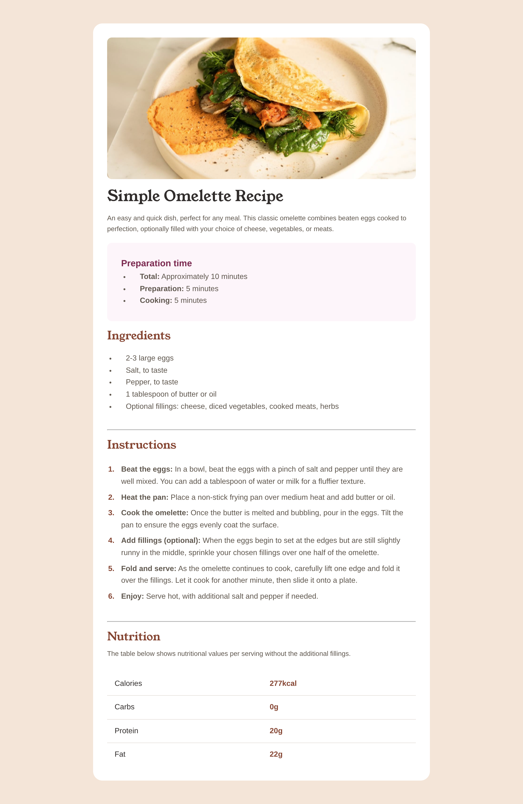

# Frontend Mentor - Recipe page solution

This is a solution to the [Recipe page challenge on Frontend Mentor](https://www.frontendmentor.io/challenges/recipe-page-KiTsR8QQKm). Frontend Mentor challenges help you improve your coding skills by building realistic projects.

## Table of contents

-   [Overview](#overview)
    -   [Screenshot](#screenshot)
    -   [Links](#links)
-   [My process](#my-process)
    -   [Built with](#built-with)
-   [Author](#author)

## Overview

### Screenshot

### Links

-   [Solution on Frontend Mentor](https://www.frontendmentor.io/learning-paths/getting-started-on-frontend-mentor-XJhRWRREZd/steps/683ce93f9b5ac95dc52cbad4/challenge/refactor)
-   [Live Site](https://wolf-root.github.io/Frontend-Mentor-Recipe-page/)

## My process

### Built with

-   HTML5
-   Scss
-   Flexbox

## Author

-   Website - [My Portfolio](https://yousseffed.vercel.app/)
-   Frontend Mentor - [Wolf-Root](https://www.frontendmentor.io/profile/Wolf-Root)
-   Twitter - [wolf_R00T](https://x.com/wolf_R00T)
